# Synapse — 你的第二记忆

> 带长期记忆的研究助理，记忆跟着你走，不管你在哪个 AI 工具里——网页对话、Claude Code、Codex、Cursor。所有对话都沉淀成可溯源的研究画像。

像和普通助手聊天一样正常对话——挂载本地文件夹、提问、获得回答。Synapse 在后台把对话切成结构化记忆（L0→L1→L2→L3）。粘贴一段指令就能连上 Claude Code、Codex、Cursor 或任何 MCP 客户端，它们的对话也会自动同步回来——是一份记忆，不是每个工具各存各的。偶尔，在一次很平常的回复里，它会悄悄浮出一段话：*「Synapse 注意到——过去 9 天里，你在 10 个不同的研究线索里反复触碰同一个未解问题……」*——不是按钮触发的，是积累到一定厚度后被动出现的。

**[English README → README.md](README.md)**

---

## Demo 视频

[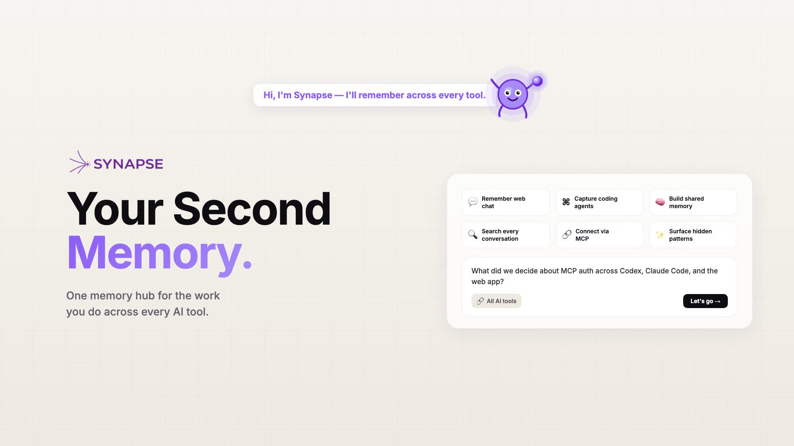](https://synapse.cjlin.com/demo-zh)

▶ **[观看 96 秒产品 Demo（中文配音）](https://synapse.cjlin.com/demo-zh)** · [English version](https://synapse.cjlin.com/demo-en)

---

## 界面截图

### 主页 — 空状态，随时连接你的本地文件夹

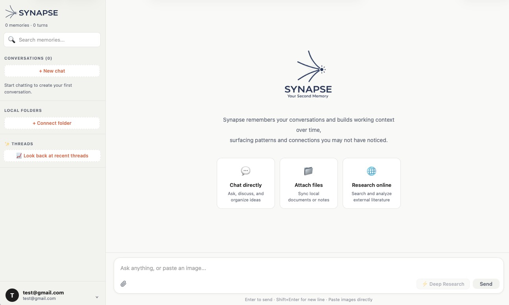

### 对话 — 每条回复都基于记忆召回

Synapse 在每次回复前都会搜索你积累的记忆，搜索过程内联显示，你可以看到具体用了哪些上下文。

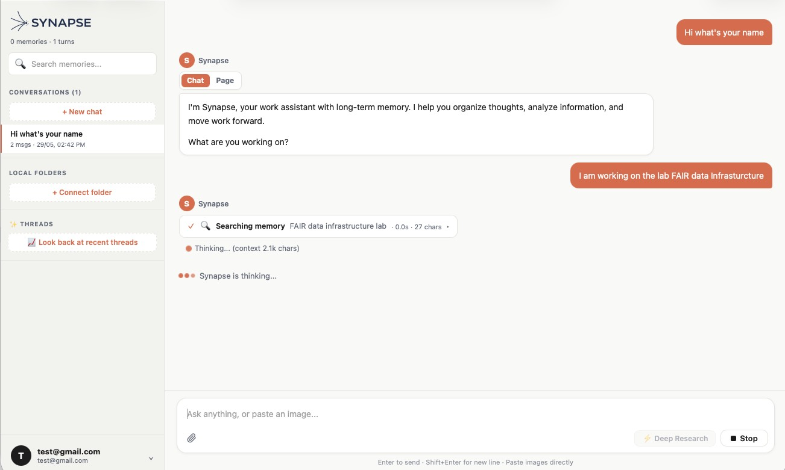

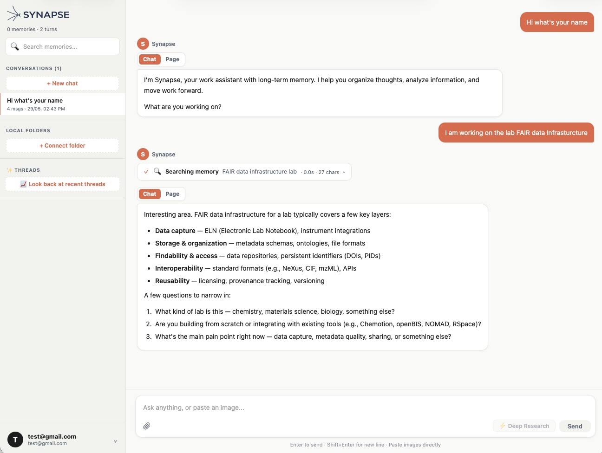

### Deep Research — 按需触发的文献 + 网络检索

点击 ⚡ **Deep Research**，把当前问题发给一个自主研究模型，它会搜索 Semantic Scholar、arXiv 和网络，再结合你已有的记忆综合分析。

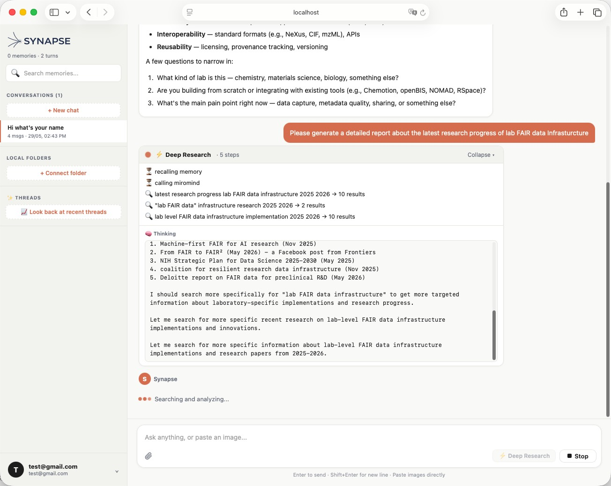

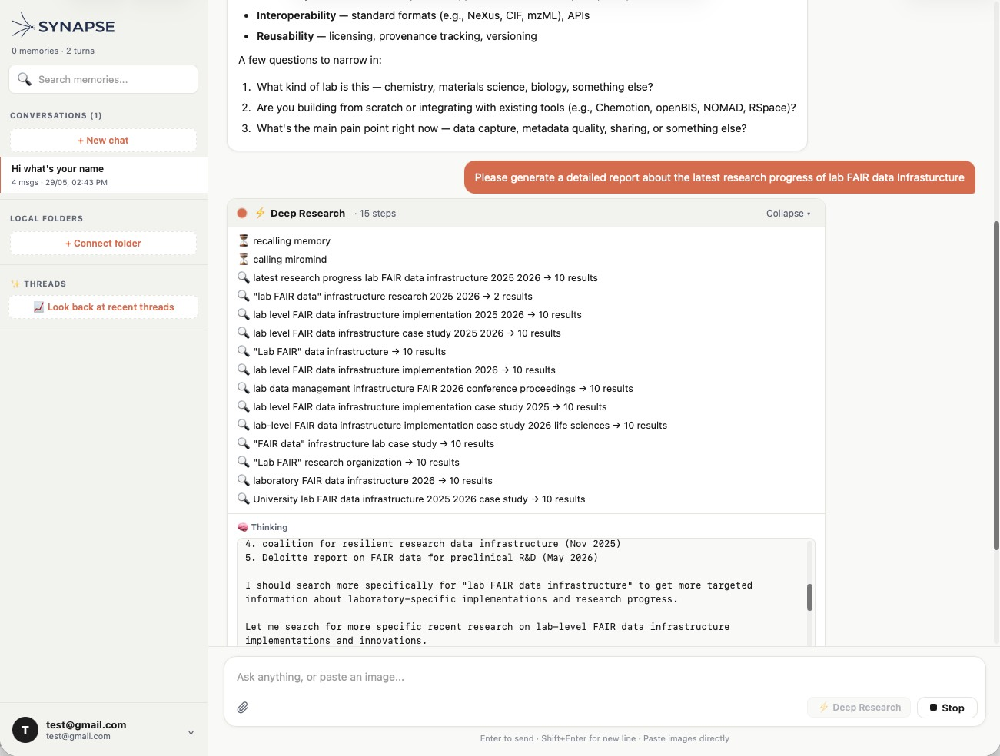

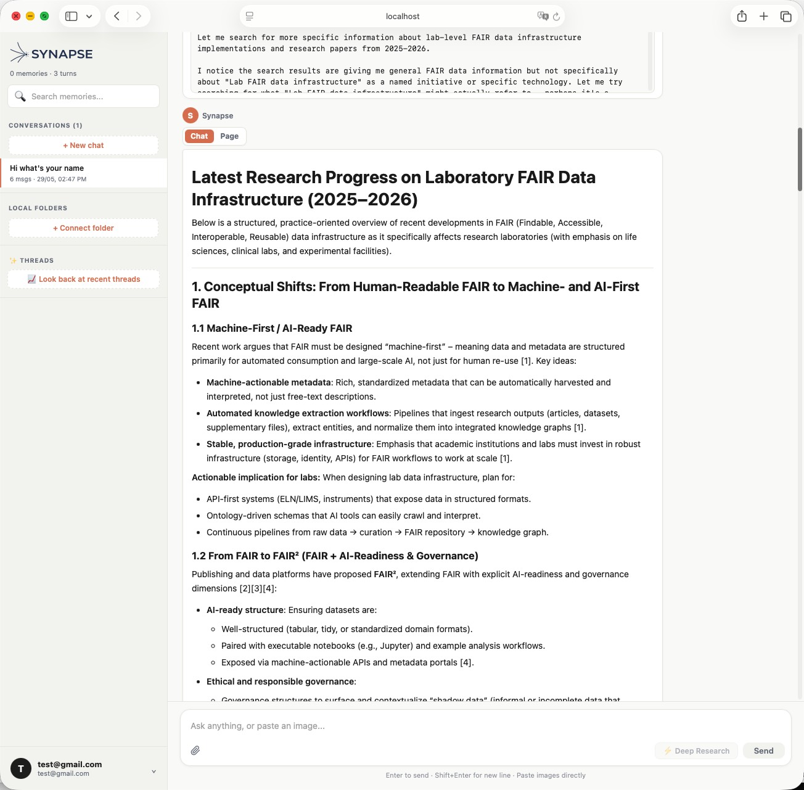

### Aha — 被动浮现的研究发现

对话积累到一定量后，Synapse 在后台扫描跨来源的模式。当你下次提问触及相关方向，一张 **「Synapse 注意到」** 卡片会内联出现——并附带一张可拖拽的证据图，把每条洞察追溯到原始来源。

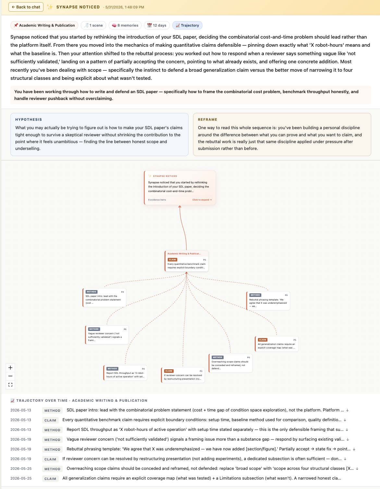

---

## 快速启动

```bash
# 1. 安装依赖
npm install

# 2. 配置环境变量
cp .env.example .env.local   # 填入下方的变量值

# 3. 启动开发服务器
npm run dev      # http://localhost:3000
```

### 环境变量（`.env.local`）

只填 fucheers 这几个变量,项目就能跑起来——openai / anthropic 都是可选的,从来不是必需的。

```
# ── 对话/流水线 LLM 后端 ──────────────────────────────────
LLM_PROVIDER=fucheers        # fucheers | openai | anthropic

# fucheers（默认，项目运行必需）
ANTHROPIC_BASE_URL=https://你的-claude-代理/
ANTHROPIC_API_KEY=sk-xxx
ANTHROPIC_MODEL=claude-sonnet-4-6

# openai（可选——只有 LLM_PROVIDER=openai 或在界面里手动选择时才会用到）
OPENAI_API_KEY=
OPENAI_BASE_URL=https://api.openai.com/v1
OPENAI_MODEL=gpt-4o

# anthropic 直连（可选——单独一套变量，避免跟上面被 fucheers 复用的
# ANTHROPIC_* 冲突）
ANTHROPIC_DIRECT_API_KEY=
ANTHROPIC_DIRECT_MODEL=claude-sonnet-4-6
ANTHROPIC_DIRECT_BASE_URL=

# Deep Research（用户主动触发）
MIROMIND_BASE_URL=https://api.miromind.ai/v1
MIROMIND_API_KEY=sk-xxx
MIROMIND_MODEL=mirothinker-1-7-deepresearch-mini

# SQLite 数据目录（默认 ./data）
TDAI_DATA_DIR=/你的/synapse-data路径
```

---

## 整体架构

```
┌─────────────────── 浏览器（Client）─────────────────────┐
│                                                          │
│  Sidebar           ChatPanel             AhaModal        │
│  • 已连接的工具     • useChat hook        • 浮层证据图   │
│  • 历史发现         • 工具回路 (toolUI)   • xyflow 节点  │
│  • 记忆 / 场景      • 文件 attach        • 可拖拽       │
│                                                          │
│  IndexedDB:                                              │
│  • synapse_folders  (FileSystemDirectoryHandle 缓存)     │
│  • synapse_pdf_cache (PDF 解析结果)                      │
│                                                          │
└──────────────────────────┬───────────────────────────────┘
                           │ HTTP (Next.js Route Handlers)
┌──────────────────────────▼───────────────────────────────┐
│                      Server (Node)                        │
│                                                           │
│  /api/chat           ── 主对话 + Aha judge + L0 落库      │
│  /api/pipeline/flush ── 强制冲 L1（用户回归时）           │
│  /api/aha/*          ── 历史 / 详情 / evidence            │
│  /api/memories       ── 侧栏数据（L0/L1/L2/L3）           │
│  /api/scene/[name]   ── 场景块详情                        │
│  /api/insight        ── Deep Research                     │
│  /api/[transport]    ── MCP server（6 个工具，PAT 鉴权）  │
│  /api/tools/*        ── 已连接的工具 + 只读归档视图       │
│  /api/tokens         ── 生成/撤销 MCP 访问令牌            │
│  /api/hook           ── 提供自动捕获脚本                 │
│                                                           │
│  scheduler.notifyTurn  ─→  l1-pipeline                    │
│        ↓ (≥5 turn 或 flush)        ↓ (≥3 new mem 后)      │
│        计数+互斥锁              l2-l3-pipeline + aha 检测  │
│                                                           │
└──────────────────────────┬───────────────────────────────┘
                           │
┌──────────────────────────▼───────────────────────────────┐
│  本地存储                                                  │
│  • SQLite (memory.db)   ── L0 对话 / L1 记忆 / state      │
│  • scene_blocks/*.md    ── L2 场景块                      │
│  • persona.md           ── L3 画像                        │
│  • backup/              ── 自动版本快照                   │
│                                                           │
│  外部 API（按需）                                          │
│  • Claude 兼容代理  ── 主对话 + 所有抽取                  │
│  • miromind         ── Deep Research                      │
│  • Semantic Scholar / arXiv ── Aha 外部文献补足           │
└────────────────────────────────────────────────────────────┘
```

外部 AI 工具(Claude Code、Codex、Cursor、任何 MCP 客户端)完全不经过浏览器——它们直接通过 MCP 打 `/api/[transport]`，一个 Stop hook(`scripts/hooks/synapse_sync.py`，从 `/api/hook` 下载)每轮结束后把这一轮对话 POST 给 `log_conversation`。完整流程见下面的[连接任何 AI 工具](#连接任何-ai-工具mcp--自动捕获)。

---

## 记忆系统：L0 → L1 → L2 → L3

照搬 [TencentDB Agent Memory](https://github.com/Tencent/TencentDB-Agent-Memory) 的四层结构，只改两处：L1 类型换成研究语境、`MemoryRecord.metadata` 加 `ontology_label`。

| 层 | 是什么 | 物理存储 | 谁写 | 谁读 |
|---|---|---|---|---|
| **L0** | 原始对话（每条 user / assistant message） | SQLite `l0_conversations` + FTS5 trigram | `/api/chat` onFinish | recall、Aha evidence |
| **L1** | 原子研究记忆（claim / method / observation / dataset / experiment / finding / question / goal） | SQLite `l1_records` + FTS5 trigram | `l1-pipeline`（每 5 turn 或 flush） | 侧边栏、recall、Aha 检测 |
| **L2** | 主题场景块（围绕一个研究方向聚合相关 L1） | `scene_blocks/*.md` | `l2-l3-pipeline`（每攒够 3 条新 L1） | 侧边栏、evidence graph |
| **L3** | 稳定研究者画像 | `persona.md` | `persona-generator`（场景累计变化达阈值） | 主对话 system prompt |

### 触发：纯计数 + 互斥锁，无时间触发

```
每次 /api/chat onFinish:
  scheduler.notifyTurn(sessionKey)
    turnCount++
    if turnCount >= 5:
       runL1Pipeline()  ← 加 l1Running mutex
       if newMemoriesSinceLastL2 >= 3:
         runL2L3Pipeline()  ← 加 l2Running mutex
         runAhaDetection()
       turnCount = 0
```

不存在「空闲 N 分钟触发」之类的定时器。用户回到 chat 时 `synapse-app.tsx` 自动 POST `/api/pipeline/flush` 一次，把残留 turn 冲掉。

---

## 记忆召回：让每条回复都有依据

每轮对话前，Synapse 都会召回相关记忆并决定怎么用——这跟后台的 Aha 检测是两套独立逻辑，召回是**每轮**都跑、给回复打底。分三层：

**1. 召回 (`lib/memory/recall.ts`)** —— 每条用户消息进来：
- **L3 画像** (`persona.md`)：永远注入，不需要匹配——它是常驻的「你是谁」档案。
- **L1 记忆**：用 FTS 搜出与当前消息最相关的 8 条（用户级全局，跨所有会话）。
- 把两者交给关系分析器。

**2. 关系分析 (`lib/memory/insights/context-analyzer.ts`)** —— 一次轻量 LLM 调用，给每条召回记忆打标签：
- `connection` 🔗 —— 有信息量的关联（同项目的早期决策、同概念的较早讨论）。
- `contradiction` ⚠️ —— 真冲突（你改了主意、用了相反方案）。
- 其余一律丢弃——prompt 强制「宁缺毋滥」，空结果合法且常见。

**3. 注入** —— `formatRecallContext` 把 `<researcher-profile>` + `<relevant-research-memories>` + `<noteworthy-links>` 拼好，`/api/chat` 再接进 system prompt。其中 `<noteworthy-links>` 明确指示主对话 LLM：**在回答完主要问题之后**，用很轻的笔触自然地点一下 1-2 条关联或冲突（「顺便注意到，这跟你之前的 X 有连续性」／「上次你倾向 A，这次改主意了吗？」），如果都不自然就全部忽略。

这是即时的「我记得你提过…」那一层，跟 Aha 不同：召回每轮都跑、给回复打底；Aha 在后台跑、把跨场景模式做成卡片浮现。

---

## Aha：被动浮出的研究观察

不是「按钮 → 生成」，是后台扫描 L1 时发现「同一想法跨 ≥3 个来源、跨度 ≥3 天反复出现」时，自动合成一段三段式（observation / hypothesis / reframe），等用户下次发了相关问题时 inline 推送，并往侧边栏挂一个 ✨「新发现」徽章。

**完整链路：**

1. `runAhaDetection`（L1 完成后跑）扫 L1，找跨源记忆 ≥3 条 + 跨度 ≥3 天 → 写 `aha_pending` + `aha_last` + `aha_history`
2. 用户下次发消息时 `shouldFireAhaLLM`（LLM 判官）判断当前 query 是否相关 → YES 才 inline 注入
3. 侧边栏轮询 `/api/aha/last` 看 unseen → 显示 ✨「新发现」脉冲徽章
4. 点徽章 → `AhaModal` 浮层 + `EvidenceGraph` 拖拽式证据图
5. 侧边栏「✨ 历史发现」区永久列出每条 Aha，随时回看

**外部文献补足**：合成 Aha 时把 pattern 蒸馏成英文关键词去 Semantic Scholar + arXiv 各捞一条支撑文献，挂在 `externalSources` 上——失败不影响 Aha 本身。

---

## 连接任何 AI 工具：MCP + 自动捕获

Synapse 不只是网页聊天——它是一个记忆中枢，任何支持 MCP 的 AI 工具都能读写。Claude Code、Codex、Cursor，或任何其他 MCP 客户端，**只要粘贴一段指令**就能连上，不用手动改配置文件。

**接入方式(账号菜单 → 连接 AI 工具)：**

1. 在界面里生成一个个人访问令牌。
2. 选择你的工具；Synapse 会生成一段专门针对该工具真实 MCP 配置格式和钩子协议的安装指令(Claude Code 的 `~/.claude/settings.json` Stop hook 和 Codex 的 `[[hooks.Stop.hooks]]` TOML 写法完全不一样——适配器 `lib/mcp-adapters.ts` 认得出这个区别，不会瞎猜)。
3. 把这段指令粘贴进那个工具的对话里。它会自己注册 MCP server，并下载一个 Stop hook 脚本(`scripts/hooks/synapse_sync.py`，通过 `/api/hook` 公开提供)，每一轮对话结束都会触发一次。

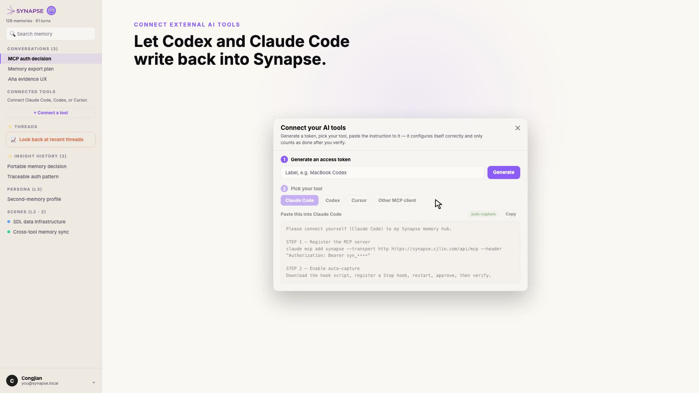

**接入之后：**

粘贴进去的那段指令，会像一次普通对话一样在那个工具里自己跑完——注册 MCP server、装好钩子、回复确认：

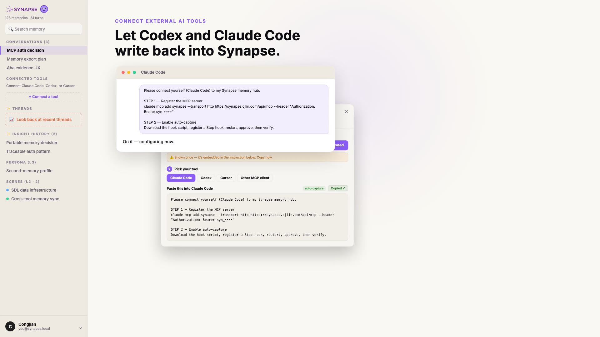

- 那个工具里每一轮结束的对话都会自动同步到 Synapse，不需要你说"记住这个"。这个钩子每次只发送最后一轮用户↔助手的对话内容(不会发送整段会话记录)，而且它是本地脚本发出的一次普通 HTTP 请求——完全不占用那个 AI 工具自己的模型上下文或 token 用量。
- 同步过来的对话有自己独立的会话命名空间(`chat_<user>_ext_<source>_<project>`)，会出现在侧边栏的 **已连接的工具** 树里，按 工具 → 项目 → 会话 分层——跟你的网页对话历史分开存放。
- 点进去会打开一个**只读归档**视图(`/tools/[source]/[project]`)，原样展示那个工具里发生的完整对话。
- MCP server 还给已连接的 AI 暴露了可以直接调用的工具：`get_context`、`search_memory`、`search_conversations`、`remember`、`log_conversation`、`get_insights`——比如 Claude Code 可以把你的研究上下文拉进一个编程会话，或者你直接跟它说"记住这个"，它就能写进网页聊天也在读的同一份记忆里。

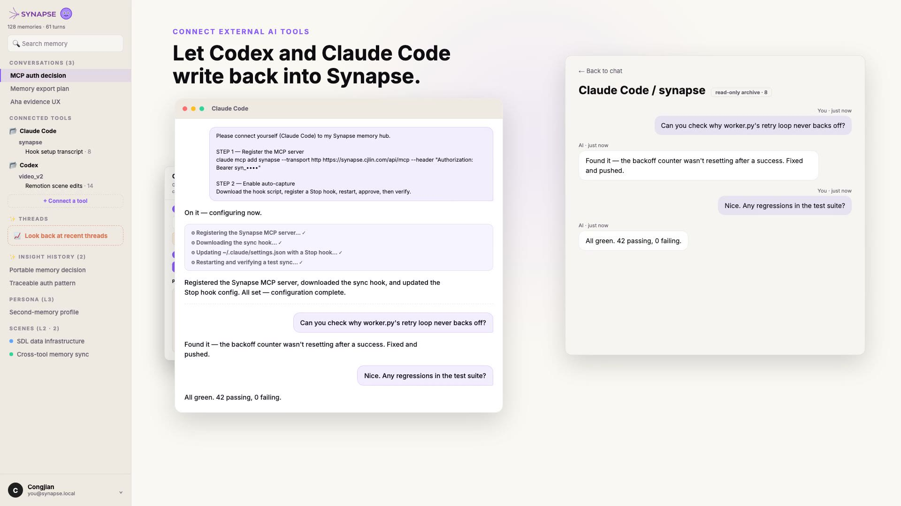

**搜索**走的是混合检索：本地 `bge-m3` 向量嵌入(通过 `node-llama-cpp`，不依赖外部嵌入 API)和 FTS5 通过 Reciprocal Rank Fusion 融合，精确关键词命中和语义相似的改写说法都能搜到——而且精确短语命中会被加权，排到语义相似但没命中关键词的结果前面。

---

## 文件同步：仅元数据 + LLM 主动读取

**关键约束**：文件夹同步**不会**自动把文件内容塞进数据库。

```
连接文件夹 → 浏览器 File System Access API → IndexedDB 缓存 handle
扫描树 → 收集 metadata（路径/大小/扩展名） → 推送 synced-files-bus
chat 请求 body 只带 metadata（≤5KB）

如果 LLM 觉得需要某个文件，主动调 read_synced_file(path)
→ 服务端流暂停 → 浏览器 FileSystemFileHandle 读文件 → 走两轮 HTTP 回客户端
→ 再恢复 LLM 流，把内容当 tool result 喂回去
```

只有当用户**实际让 LLM 读过**某文件、并在这次对话里讨论了，对话本身才作为 L0 落库——文件本身永远不进 L0。

---

## 技术栈

| 层 | 选型 | 说明 |
|---|---|---|
| 框架 | Next.js 14（App Router） | RSC + Route Handlers |
| 主对话 LLM | 抽象成 provider 接口(`lib/llm/provider.ts`) | 默认 fucheers(`claude-sonnet-4-6`)，openai/anthropic 都是可选项——项目光用 fucheers 一个 key 就能跑 |
| 跨工具同步 | Model Context Protocol(`@modelcontextprotocol/sdk`) | 按客户端适配的连接指令 + Stop hook 自动捕获，见[连接任何 AI 工具](#连接任何-ai-工具mcp--自动捕获) |
| Deep Research LLM | `mirothinker-1-7-deepresearch-mini` | 用户主动触发 |
| AI SDK | `ai` v6 + `@ai-sdk/openai`/`@ai-sdk/anthropic` v3 | `useChat` + `DefaultChatTransport` |
| 数据库 + 搜索 | `better-sqlite3` + FTS5 trigram tokenizer + `sqlite-vec` | 混合搜索：本地 `bge-m3` 向量嵌入(`node-llama-cpp`)与 FTS5 通过 RRF 融合 |
| 图可视化 | `@xyflow/react` v12 | Aha 证据图 |
| PDF 解析 | `pdfjs-dist` v5 | 浏览器端懒加载 |
| 外部检索 | Semantic Scholar API + arXiv API | 直接 fetch，无 SDK |
