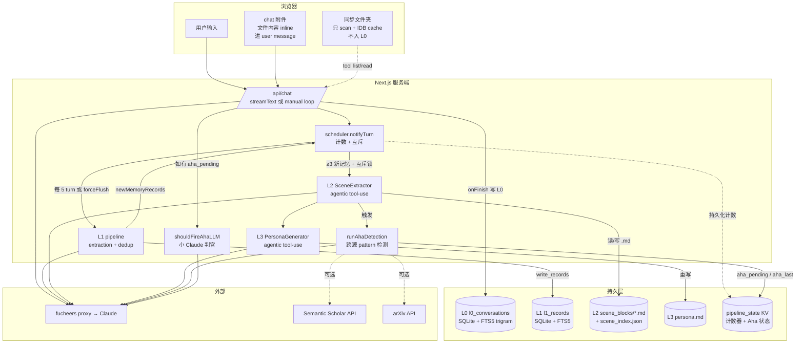
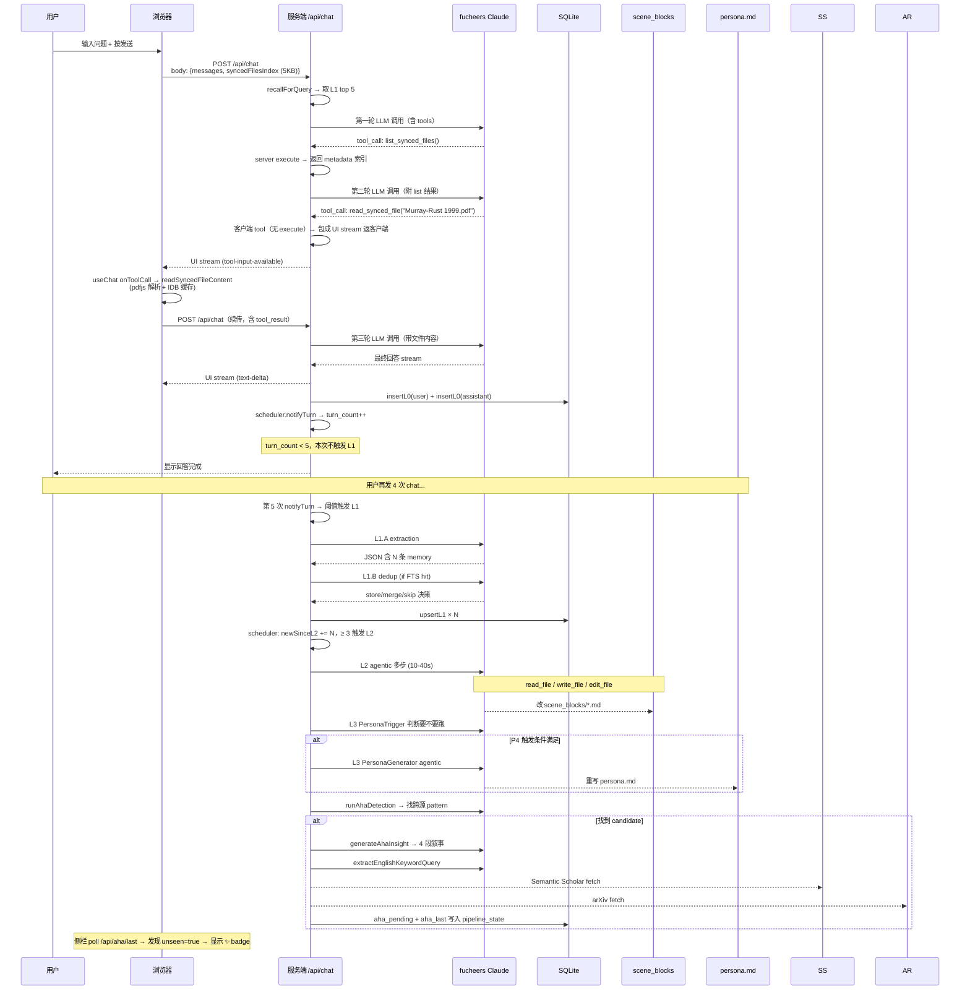

# Synapse 记忆链

> 从「用户敲下一行字」到「persona.md 被改写」的完整数据流。
> 谁触发谁、谁产出什么、什么时候才跑、哪里会失败、怎么调参。

---

## 1. 一图总览



---

## 2. 各层语义

| 层 | 是什么 | 物理位置 | 谁写 | 谁读 |
|---|---|---|---|---|
| **L0** | 真实的 user / assistant 对话消息 | `data/memory.db` 表 `l0_conversations` + FTS5 索引 `l0_fts` | `/api/chat` 的 `afterFinish` | `tdai_conversation_search` 工具、L1 pipeline、recall |
| **L1** | LLM 抽取的原子记忆（claim/method/observation/dataset/experiment/finding/question/goal）| `l1_records` + `l1_fts` | L1 pipeline `upsertL1()` | `tdai_memory_search` 工具、L2 pipeline、recall、Aha detection |
| **L2** | LLM 聚合的主题场景块（含 META 头 + markdown 正文）| `data/scene_blocks/*.md` + `data/.metadata/scene_index.json` | L2 SceneExtractor agentic 写文件 | sidebar `/api/memories`、L3 generator、`AhaModal` 证据图 |
| **L3** | LLM 综合的用户画像（4-chapter 模板 + LLM 填充内容）| `data/persona.md` | L3 PersonaGenerator agentic 重写 | chat recall（注入 system prompt）|
| **Aha** | LLM 合成的跨多 scene 洞察（pattern + observation + hypothesis + reframe + externalSources）| `pipeline_state` KV：`aha_pending` 待触发，`aha_last` 历史 | runAhaDetection → generateAhaInsight | 侧栏 badge、chat inline inject、`AhaModal` |

**重要不变量**：
- **文件不入 L0**——同步文件夹只 scan + cache `FileSystemDirectoryHandle` 到 IndexedDB。文件内容只在用户通过 chat tool `read_synced_file()` 主动调用时才被读出，且**只经过服务端一次 in-transit**，不写盘
- **L1/L2/L3 跨 sessionKey 全局可见**——recall 不按 session 过滤；任何 chat session 都能用到所有积累的记忆
- **L0 按 sessionKey 隔离查询**——但 `recallForQuery()` 内部仍是按文本检索，不过滤 session

---

## 3. 触发时机（纯计数 + 互斥，无时间）

代码：`lib/memory/scheduler.ts`

| 触发器 | 条件 | 谁负责检查 |
|---|---|---|
| L1 自动触发 | `turn_count:<sessionKey>` ≥ `TURNS_PER_L1 = 5` | `notifyTurn()` 调用时，每次 turn count +1 后判断 |
| L1 强制触发 | 任何 `turn_count > 0` | `/api/pipeline/flush` POST（SynapseApp mount 时自动调）|
| L2 自动触发 | L1 产出的 `newMemoryRecords` 累计 ≥ `NEW_MEMS_PER_L2 = 3` | `runL1AndMaybeL2()` 内部 |
| L2 互斥 | `l2Running.has(sessionKey)` → 标 `l2Dirty` 等当前 L2 完后补跑 | `maybeRunL2()` |
| L3 | PersonaTrigger 5 优先级（P1 显式 / P2 冷启动 / P2.5 损坏恢复 / P3 首个 scene 后 / P4 ≥ N 新记忆）| `runL2L3Pipeline` 内部 `PersonaTrigger.shouldGenerate()` |
| Aha 检测 | `runAhaDetection()` 在每次 L2 完成后跑；要求 ≥ 10 总记忆、≥ 2 来源、≥ 3 记忆、≥ 3 天跨度 | scheduler 在 L2 之后 fire-and-forget |
| Aha chat inline | `shouldFireAhaLLM()` 用一次小 Claude 调用判断「用户当前问题是否与 aha pattern 相关」 | `/api/chat` 接受请求时 |
| Aha 侧栏 badge | `aha_last.detectedAt > aha_last_seen_at` | sidebar `useEffect` poll `/api/aha/last` |

**没有时间触发**：原版 TencentDB 的 `l1IdleTimeoutSeconds` 10min / `l2MinIntervalSeconds` 15min / `l2DelayAfterL1Seconds` 30s 全部砍掉。残量靠 SynapseApp mount 时主动 `/api/pipeline/flush`。

---

## 4. LLM 调用清单

| # | 调用方 | 系统 prompt | 工具 | 任务 | 模型 | 耗时 |
|---|---|---|---|---|---|---|
| C1 | 主 chat | `BASE_SYSTEM_PROMPT` + recall context | `tdai_memory_search`, `tdai_conversation_search`, `list_synced_files`（server execute）+ `read_synced_file`（client execute）| 回答用户 | fucheers Claude | 3-15s（含 tool loop）|
| C2 | `runChatLoop` 内部 | 同 C1 | 同 C1 | 非流式 manual loop（绕过 proxy streaming tool 截断 bug）| fucheers Claude | 单步 2-5s × N 步 |
| L1.A | `runL1Pipeline` 步骤 1 | `EXTRACT_MEMORIES_SYSTEM_PROMPT` | 无 | 把 5 bg + 10 new L0 抽成 atomic memory 数组 | fucheers Claude | 3-5s |
| L1.B | `runL1Pipeline` 步骤 2 | `CONFLICT_DETECTION_SYSTEM_PROMPT` | 无 | 对每条新 memory 决定 store / merge / skip | fucheers Claude | 2-3s（条件触发：有 FTS 相似候选时）|
| L2 | `SceneExtractor.extract` | `buildSceneExtractionPrompt` | `list_dir / read_file / write_file / edit_file` 沙箱 | 把 memory 安排到 scene_blocks/*.md，自己规划 CREATE / UPDATE / MERGE / ARCHIVE | fucheers Claude | 10-40s (5-15 步) |
| L3 | `PersonaGenerator.generate` | `buildPersonaPrompt` | 同 L2 + 沙箱到 dataDir | 读 scene_blocks/* 重写 persona.md | fucheers Claude | 8-30s (5-10 步) |
| A1 | `generateAhaInsight` | aha synthesis prompt | 无 | 看 8 条 memory 输出 `{pattern, observation, hypothesis, reframe}` | fucheers Claude | 3-6s |
| A2 | `extractEnglishKeywordQuery` | 关键词提取 prompt | 无 | 把中文 pattern + observation 抽成 3-6 个英文关键词供搜索 API | fucheers Claude | 1-2s |
| A3 | `shouldFireAhaLLM` | 相关性判官 prompt | 无 | 回 YES / NO 决定要不要在 chat 里 inline inject Aha | fucheers Claude | 1s |
| DR | `/api/insight`（Deep Research）| Synapse 深度研究 prompt | `search_semantic_scholar / search_arxiv`（手动 tool loop）| 综合用户记忆 + 外部文献给深度分析 | miromind mirothinker-1-7 | 30-150s |

> Aha 的外部文献抓取（Semantic Scholar / arXiv）**不是 LLM 调用**，是普通 HTTP fetch。
> miromind **只用于 Deep Research**（用户主动 `⚡ Deep Research` 按钮触发），**不**用于 Aha 生成或记忆 pipeline。

---

## 5. 关键文件 → 层 映射

| 文件 | 是什么层 |
|---|---|
| `data/memory.db` | L0 + L1 + pipeline_state KV（SQLite + FTS5 trigram 分词器）|
| `data/scene_blocks/*.md` | L2 |
| `data/.metadata/scene_index.json` | L2 索引（heat / summary / 时间戳）|
| `data/persona.md` | L3 |
| `data/.backup/`、`data/.backups/` | L2 / L3 写入前自动 BackupManager 滚动 5 份 |
| 浏览器 IndexedDB `synapse_folders.handles` | FileSystemDirectoryHandle 缓存（OT B）|
| 浏览器 IndexedDB `synapse_pdf_cache.parsed` | pdfjs-dist 解析结果按 `path@mtime` 缓存 |

源码：

| 模块 | 主要导出 |
|---|---|
| `lib/memory/store.ts` | `insertL0 / queryL0ForSession / searchL0Fts / queryL0ByIds / upsertL1 / searchL1Fts / queryL1ByIds / countL0 / countL1 / get|setPipelineState` |
| `lib/memory/l1-pipeline.ts` | `runL1Pipeline() → {newMemoryRecords}`（不再自己触发 L2）|
| `lib/memory/l2-l3-pipeline.ts` | `runL2L3Pipeline({newMemories})`（包 L2 + L3 评估） |
| `lib/memory/scheduler.ts` | `notifyTurn / forceFlush`（计数 + 互斥）|
| `lib/memory/aha.ts` | `runAhaDetection / generateAhaInsight / shouldFireAhaLLM / getAhaPending / getAhaLast / markAhaLastSeen` |
| `lib/memory/recall.ts` | `recallForQuery(text) → {memories, persona, contextText}` 在 chat 前注入 |
| `lib/memory/search-tools.ts` | `buildChatTools()` 返回 `tdai_memory_search / tdai_conversation_search`（server execute）|
| `lib/memory/synced-file-tools.ts` | `buildSyncedFileTools(index)`：`list_synced_files`（server execute）+ `read_synced_file`（无 execute → 客户端）|
| `lib/memory/chat-loop.ts` | `runChatLoop()` 手动 tool loop，绕开 fucheers streaming bug |
| `lib/synced-files.ts` | `collectSyncedFilesIndex / readSyncedFileContent / parsePdfToText` |
| `lib/folder-cache.ts` | IndexedDB 持久化文件夹 handle |
| `lib/tencentdb/scene/scene-extractor.ts` | L2 agentic 实现 |
| `lib/tencentdb/persona/persona-generator.ts` | L3 agentic 实现 |
| `lib/tencentdb/persona/persona-trigger.ts` | L3 触发条件 5 优先级 |

---

## 6. 文件 / 记忆 / 对话三类输入怎么 fan-in

```mermaid
flowchart LR
  CHAT[用户聊天消息]
  ATT[chat 附件\n文件内容 inline]
  SF[同步文件夹\n按需 read_synced_file]

  CHAT -->|"onFinish 写 user + assistant"| L0
  ATT -->|"等同 chat（user message 含文件内容）"| L0
  SF -.tool result.->|"仅在 LLM 主动调时\n经服务端 in-transit\n不写盘"| LLMCTX[LLM context]

  L0 -->|scheduler 批 5| L1
  L1 -->|"scheduler 累计 ≥ 3"| L2
  L2 --> L3
```

**注意**：
- 同步文件夹的文件**不会**通过任何路径自动写到 L0
- 文件信息只有两种方式进入 LLM 上下文：
  1. 用户在聊天框「附件」里挂上来 → 内容包在 user message 里
  2. LLM 自主调 `read_synced_file()` → tool result 是文件内容
- 两种方式都会通过 chat → L0 → L1/L2/L3 这条标准链路

---

## 7. 故障模式与降级

| 故障 | 降级 |
|---|---|
| fucheers proxy streaming + tool_calls bug（args 截成空串）| `app/api/chat/route.ts` 走 `runChatLoop` 手动 non-streaming，包装成 UI message stream |
| fucheers proxy 流式 vision 剥掉图片 | vision branch 走 `generateText` 非流式 |
| fucheers proxy OpenAI 风格 `image_url` 不认 | `createProxyFetch` 自动重写为 Anthropic 风格 `{type:"image", source:{...}}` |
| Aha 外部文献 fetch 失败 / Semantic Scholar 限速 | `externalSources` 留空 |
| Aha LLM 判官失败 | fallback 到 `shouldFireAhaFallback`（bag-of-words 字面包含）|
| L1 extraction LLM 失败 | 返回 `{newMemoryRecords: []}`，scheduler 视为 0 新记忆 |
| L1 dedup LLM 失败 | 默认全部 store（不合并）|
| L2 agentic 超时 | 300s timeout，跳过本批 memory（不写 scene），下次再试 |
| L3 PersonaTrigger 拒绝 | persona 不更新（不影响其他流程）|
| pdfjs 解析失败 | `read_synced_file` 返回 `error` 字符串给 LLM |
| IndexedDB 文件夹 handle permission 失效 | 侧栏显示 🔒「需重新授权」按钮，等用户手动点击 |
| 客户端 `read_synced_file` tool 调用失败 | onToolCall handler catch 后 `addToolResult({output: "Error: ..."})` 让 LLM 知道 |

---

## 8. 全部可调参数

| 参数 | 默认 | 位置 | 含义 |
|---|---|---|---|
| `TURNS_PER_L1` | 5 | `lib/memory/scheduler.ts:39` | 多少轮 chat 触发一次 L1 批处理 |
| `NEW_MEMS_PER_L2` | 3 | `lib/memory/scheduler.ts:40` | L1 累计多少新记忆才触发 L2 |
| `BG_MESSAGES` | 5 | `lib/memory/l1-pipeline.ts:39` | L1 prompt 前置背景消息数 |
| `NEW_MESSAGES` | 10 | `lib/memory/l1-pipeline.ts:40` | L1 prompt 新消息数 |
| `maxScenes` | 15 | `lib/tencentdb/scene/scene-extractor.ts:99` | L2 最多 scene 数限额 |
| `maxSteps` | 25 | `lib/tencentdb/runtime/tool-runner.ts:60` | L2 / L3 agentic 循环最多步数 |
| `timeoutMs` | 300_000 | scene-extractor / persona-generator | L2 / L3 单次 LLM 超时 |
| Aha 触发 `memories.length` | ≥ 10 | `lib/memory/aha.ts` | 总记忆数下限 |
| Aha 触发 `sourceCount` | ≥ 2 | `lib/memory/aha.ts` | pattern 跨多少独立来源 |
| Aha 触发 `memories per pattern` | ≥ 3 | `lib/memory/aha.ts` | 同一 pattern 至少多少条记忆 |
| Aha 触发 `spanDays` | ≥ 3 | `lib/memory/aha.ts` | 时间跨度最少几天（hackathon 放宽，原 14）|
| `maxTokens` 各处 | 4096 / 2048 / 512 | 各调用点 | L1=4096, dedup=2048, Aha=512 |
| `MEMS_PER_ROW` | 4 | `components/evidence-graph.tsx` | xyflow 证据图每行 memory 节点数 |
| 同步 PDF 解析单文件截断 | 80_000 chars | `lib/synced-files.ts` | `read_synced_file` 返回最大长度 |

---

## 9. 数据生命周期：一次完整 chat 的链路追踪

例：用户发「概括 Murray-Rust 1999 这篇论文」。



---

## 10. 旧 TencentDB 原版差异（已移植 vs 已删 vs 故意不同）

| 项 | 原版 TencentDB | Synapse | 备注 |
|---|---|---|---|
| L0-L3 四层架构 | ✅ | ✅ | 完全保留 |
| L1 类型 | `persona / episodic / instruction` | `claim / method / observation / dataset / experiment / finding / question / goal` | 改成工作类型 + 加 `ontology_label` 元数据 |
| L0 表 | `l0_conversations` + vector store | `l0_conversations` + FTS5 trigram，无 vector | fucheers proxy 不提供 embedding |
| Pipeline 触发 | 计数 + idle timer + min interval | **纯计数 + 互斥**，无时间 | 用户明确不要时间触发 |
| L2 调度 | `l2MinIntervalSeconds = 900` 硬节流 | per-session 互斥锁 + dirty 重排 | 同样防 race，更可预测 |
| L3 触发 | `persona.triggerEveryN = 50` | PersonaTrigger 5 优先级 | 原版逻辑保留 |
| 文件 ingest | 不存在（host 把文件塞 user message 走 turn 入口）| 同样不存在 | 同步文件夹只 scan，文件经 chat tool 按需读 |
| Aha Insight | 不存在 | 新增整套（检测 + 合成 + 外部文献 + 判官 + UI）| Synapse 原创 |
| Deep Research | 不存在 | miromind tool loop | Synapse 原创 |
| 证据图 UI | 不存在 | xyflow 三层图（顶点 / scene / memory）+ drawer | Synapse 原创 |
| BackupManager | ✅ 滚动 5 份 | ✅ 沿用 | 保留以防 L2/L3 LLM 写坏文件 |

---

## 11. 调试入口

| 想看什么 | 调用 |
|---|---|
| 当前所有 L1 | `GET /api/memories` |
| 单条 L1 + 原始 L0 | `GET /api/memory/[id]` |
| 单个 scene markdown | `GET /api/scene/[filename]` |
| 当前 persona | 直接 `/persona` 页面或 `cat data/persona.md` |
| 当前 Aha 状态 | `GET /api/aha/last` |
| 强制重新生成 Aha | `GET /api/aha/last?force=1` |
| 给 LLM 看的证据链 | `POST /api/aha/evidence` body: `{memoryIds: [...]}` |
| 推进卡住的 pipeline | `POST /api/pipeline/flush` |
| Aha 调试页面 | `http://localhost:3000/aha-mock` |
| L2 备份 | `data/.backup/scene_blocks/offsetN/` |
| L3 备份 | `data/.backup/persona/offsetN.md` |

---

## 12. 常见错觉澄清

| 听起来像 | 真相 |
|---|---|
| 「同步文件夹后 LLM 自动知道这些文件」 | ❌ 不会。LLM 只看到 metadata 索引（path + size），要读必须自己调 `read_synced_file` |
| 「persona.md 是模板填空」 | 章节框架（4 Chapter + emoji）是模板规定的，**内容 100% LLM 生成** |
| 「L1 是 LLM 总结的话」 | 是 LLM 从对话**抽取**的原子事实，不是总结 |
| 「Aha 是上下文末尾追加的固定提示」 | 是后台**自动检测的**跨源 pattern，再让 LLM 合成 4 段叙事；侧栏 badge + chat inline 是两条独立通路 |
| 「scheduler 让 pipeline 跑得慢」 | scheduler 是节流，让单 chat 不再触发雪崩；**总产出**不变，但**频率**降低，**成本**降低 |
| 「文件内容会塞进 HTTP body 一次发送给 LLM」 | ❌ 不会。文件只在 LLM 主动调 tool 时才被读，然后**经服务端 in-transit** 一次（不写盘）送进 LLM context |
